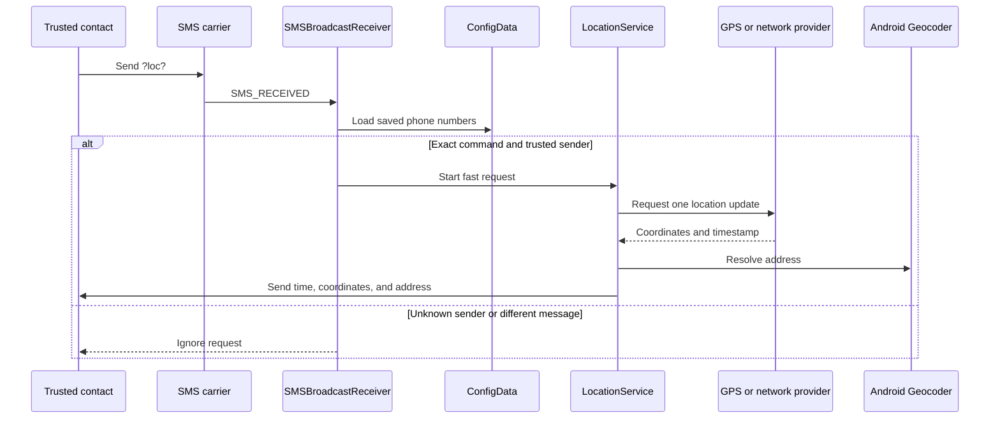

# FindMe 📍

FindMe is a native Android portfolio prototype for sharing a device location with trusted contacts over SMS. It combines local contact management, runtime permission handling, GPS/network location updates, geocoding, foreground services, and emergency messaging without a custom backend or user account.

> **Status:** working portfolio prototype, version `1.0`.

## 🧭 Overview

The application stores trusted phone numbers locally. A user can send an SOS message to every saved contact, request a location update for one contact, or allow an authorized contact to request the location by sending the exact `?loc?` SMS command.

The active application is a single Android module built around one launcher `Activity`, system `BroadcastReceiver` components, a foreground `Service`, and local file storage. SMS delivery, carrier availability, device permissions, and location-provider state remain external dependencies.

## 🆘 Safety purpose and offline operating model

FindMe is intended to support location sharing in situations where a person cannot reliably use the phone interface:

- the user can send an SOS containing their current or last known location to trusted contacts;
- a trusted contact can request the user's location by sending the exact `?loc?` SMS command;
- the request can be handled while the device is locked or unattended, so a trusted person can request the last stored location when the user is incapacitated, has lost access to the phone, or cannot operate it;
- the communication channel is SMS by design because the application must remain useful when Wi-Fi and ordinary internet access are unavailable.

This design addresses time-critical situations in which waiting for an operator or another service to obtain a device location may be too slow. It is not a replacement for emergency services, carrier location procedures, medical care, or a guaranteed tracking service. The user must configure trusted contacts and grant the required permissions before an emergency occurs.

### What works without Wi-Fi

The application does not need Wi-Fi or mobile data to obtain a GPS fix or exchange the core SOS/location messages. SMS still requires the device to be registered on a mobile operator's network.

| Device condition | Expected behavior |
| --- | --- |
| Wi-Fi unavailable, GSM signal available | GPS and SMS SOS/location requests can work. |
| Wi-Fi and mobile data unavailable, GSM signal available | SMS and GPS can still work; network geocoding and OpenCellID lookups may be unavailable. |
| GPS unavailable but GSM signal available | The app can send a persisted last location, if one exists; a new precise fix may not be possible. |
| No mobile operator signal | SMS cannot be sent or received. The application cannot bypass this carrier limitation. |
| Device powered off, SIM removed, or radio disabled | Background SMS handling and location sharing cannot operate. |

The app sends coordinates and, when available, a geocoded address through the carrier's SMS service. SMS is not end-to-end encrypted. Only numbers explicitly added as trusted contacts should be configured to receive automatic location responses.

### First-run information and consent

On the first launch, before any SMS or location permission is requested, FindMe shows a short set of informational screens (`OnboardingActivity`). They explain, in the device language, why the app uses SMS, when messages are sent or received, how a trusted contact can request the location when the user cannot, and the privacy limits of the SMS channel. On the final screen the user must choose **I understand and agree** or **Disagree**. Accepting records consent locally in `SharedPreferences` (`findme_onboarding` / `sms_consent_v1`) and starts the permission flow. Choosing **Disagree** confirms that the app cannot work without consent, opens the Android uninstall screen, and closes the app; no consent is stored and the app cannot be used. Backing out of onboarding without consent also closes the app. All onboarding text is provided in English (`values/strings.xml`) and Polish (`values-pl/strings.xml`).

## 🧰 Used Technologies

<p align="left">
  <a href="https://www.java.com/"></a>
  <a href="https://developer.android.com/"></a>
  <a href="https://gradle.org/"></a>
  <a href="https://developer.android.com/jetpack/androidx"></a>
  <a href="https://m3.material.io/"></a>
  <a href="https://developers.google.com/android/guides/overview"></a>
</p>

## ✨ Key Features

- **Trusted contacts:** add phone numbers, persist them locally, remove them with a swipe gesture, and display them in a `RecyclerView`.
- **Manual location requests:** start a one-time request for a selected contact from the contact list.
- **SMS location requests:** accept the exact `?loc?` command only when the sender's number matches a saved contact.
- **Emergency location password:** an optional user-defined password enables the exact `?loc?password` command from any phone; only the SHA-256 hash is stored locally.
- **Emergency SOS:** send the last location returned by the fused location provider to all saved contacts.
- **GPS and network location:** use Android `LocationManager` providers, with GPS preferred when a recent GPS fix is available.
- **Location response:** send the measurement time, coordinates, and a geocoded address as separate SMS messages for an authorized request.
- **Foreground location service:** expose ongoing location work through an Android notification and use slower and faster refresh intervals.
- **Permission guidance:** request SMS, foreground/background location, and notification permissions in sequence and show their current status in the UI.
- **Battery settings shortcut:** open Android battery-saver settings from the main screen.

## 🏛️ Architecture

FindMe uses a small, event-driven native Android architecture rather than a multi-layer or backend-based design:

| Layer | Responsibility | Main implementation |
| --- | --- | --- |
| Presentation | Main screen, permission status, contact list, SOS action, and location display | `MainActivity`, XML layouts, `ContactsAdapter` |
| Local data | Serialize and restore trusted contacts from app-private storage | `ConfigData`, `Contact`, `ContactList` |
| System events | Receive SMS broadcasts and schedule manual contact requests | `SMSBroadcastReceiver`, `AlarmReceiverClass` |
| Background work | Obtain location, geocode it, broadcast updates, and send SMS responses | `LocationService` |
| Platform integration | Runtime permissions, notification channel, wake locks, `SmsManager`, `LocationManager`, and `Geocoder` | Android SDK and Google Play services Location |

The repository contains one `app` module. The main screen is implemented directly in `MainActivity`; the Navigation Component dependency and navigation resource are present, but the current launcher flow does not use a navigation host or feature fragments.

## 🧩 Core Modules

| Module | Role |
| --- | --- |
| [`MainActivity`](app/src/main/java/com/familysonar/MainActivity.java) | Initializes the UI, loads contacts, manages runtime permissions, handles contact changes, opens battery settings, refreshes displayed location data, and sends SOS messages. |
| [`OnboardingActivity`](app/src/main/java/com/familysonar/OnboardingActivity.java) | Shows the first-run bilingual SMS/location information screens and records the user's consent before the permission flow starts. |
| [`LocationService`](app/src/main/java/com/familysonar/LocationService.java) | Runs as a location foreground service, reads GPS/network updates, maintains the current fix, geocodes the location, notifies the Activity, and sends authorized request responses. |
| [`SMSBroadcastReceiver`](app/src/main/java/com/familysonar/SMSBroadcastReceiver.java) | Reads incoming SMS PDUs, matches the exact `?loc?` command and sender number, then starts a short fast-refresh request. |
| [`AlarmReceiverClass`](app/src/main/java/com/familysonar/AlarmReceiverClass.java) | Handles the manual contact-list request, sends a `START` message, and returns the last or next available location coordinate. |
| [`ContactsAdapter`](app/src/main/java/com/familysonar/ContactsAdapter.java) | Binds saved phone numbers to the `RecyclerView` and exposes the per-contact location action. |
| [`ConfigData`](app/src/main/java/com/familysonar/ConfigData.java) | Stores `ContactList` in the app's private files directory as `configdata.dat`. |
| [`JobService`](app/src/main/java/com/familysonar/JobService.java) | Contains an alternate cell-information SMS response path; the active SMS receiver starts `LocationService` instead of scheduling this job. |

`BootCompleteReceiverClass` is registered in the manifest and starts the low-power location service after boot when the required permissions are available. The service keeps a persistent last-location cache so an authorized `?loc?` request can receive an immediate response even before a fresh fix is obtained.

## 🔄 Data Flow

### Authorized SMS request



The foreground service uses a 20-minute low-power standard interval and a 10-second fast interval. Periodic updates do not start GPS and use a 200-meter minimum movement. A fast SMS request immediately sends the persisted last location, then attempts one fresh update for up to 30 seconds and sends a second SMS when a newer fix is available.

When an emergency password is configured, the exact `?loc?password` command is also accepted from an unknown sender and the response is sent to that sender. The password is case-sensitive, must contain 6-64 non-whitespace characters, and is never stored in plaintext.

### Local manual request and SOS

- A contact-row action schedules `AlarmReceiverClass`, which sends `START` and then sends one coordinate response using the fused last location or a provider update.
- The SOS action reads the fused last location and sends one emergency SMS to each saved contact.
- There is no public HTTP API, application server, external database, or account system in this repository.

## 📲 Google Play publication guide

This section documents the intended use of the sensitive permissions and provides a reproducible review path for a Google Play submission. It is guidance for the Play Console declaration and reviewer notes, not a guarantee of approval. Google Play may change its policy or request additional evidence.

### Core-functionality explanation for the SMS permissions

FindMe requests `SEND_SMS` and `RECEIVE_SMS` because its core safety workflow depends on direct carrier SMS:

> FindMe is a personal safety application for sending and requesting a device location through SMS when Wi-Fi, mobile data, or internet services are unavailable. The user explicitly configures trusted contacts. The user can send an SOS location message to those contacts. A trusted contact can send the exact `?loc?` command, and the application receives that SMS in the background, verifies the sender against the locally stored trusted-contact list, and sends the last known or newly obtained location back by SMS. Without `SEND_SMS` and `RECEIVE_SMS`, the defining safety workflow cannot operate on a cellular connection without internet access.

Use this explanation as the starting point for the SMS permissions declaration. Select the closest available Google Play category for physical safety or emergency alerts and describe the exact user-visible workflow. Do not describe FindMe as a general-purpose messaging application. The application does not use SMS permissions for advertising, analytics, marketing, contact harvesting, or unrelated messaging.

The declaration must also state the limitations:

- SMS requires a working SIM and mobile operator signal;
- the app cannot locate a powered-off device or bypass a disabled radio;
- location responses are sent only to trusted contacts or to the sender of a configured emergency-password request;
- SMS delivery is carrier-dependent and is not guaranteed;
- the app does not contact emergency services automatically.

If Google Play does not approve the SMS exception, the current offline SMS workflow cannot be published unchanged through Google Play. An alternative Play build would need to remove automatic SMS reception/sending, or the application would need to satisfy the requirements for a full default SMS handler. Granting a permission manually in Android settings does not bypass Google Play's restricted-permission policy.

### Background-location explanation

FindMe requests background location because a trusted contact may need to obtain a location while the user is not actively using the application. The foreground service maintains a visible notification, keeps a persisted last location, and performs a short refresh after an authorized SMS request. The app should show a prominent disclosure before requesting background location, for example:

> FindMe collects location data while the app is not visible so it can respond to an authorized location request from a trusted contact and send an SOS location through SMS. Location is used only for this safety feature and is sent to the configured recipient by SMS.

The disclosure must be shown in the application before the Android permission prompt, and the Play Console background-location declaration must match the actual implementation. Do not state that the app can provide a location when the device has no carrier signal or is powered off.

### Reviewer test instructions

Provide these instructions in the Play Console reviewer notes, together with a dedicated test number or two test devices if Google requests them. Do not publish private phone numbers or secrets in this README.

1. Use two physical, SIM-enabled Android devices. Device A has FindMe installed; device B is the trusted contact.
2. Launch FindMe on device A and read the first-run information screens describing the SMS usage; accept the final screen to give consent, then grant SMS, precise location, background-location, notification, and any other permissions shown by the app.
3. Add device B's number to **Trusted contacts** and wait for a GPS fix.
4. Turn off Wi-Fi and mobile data on device A while leaving the cellular radio and GSM service enabled.
5. Press the SOS action on device A and confirm that the location SMS is received on device B.
6. From device B, send exactly `?loc?` to device A. Device A should verify the sender and return the stored location, followed by a fresher location when one is available.
7. Lock device A's screen and repeat the request from device B to verify the background receiver and foreground location service.
8. Send `?loc?` from an untrusted number. Device A must not disclose a location.
9. Re-enable Wi-Fi or mobile data to verify optional address geocoding and OpenCellID behavior.

The reviewer should be told that a test using Wi-Fi only, a device without a SIM, an emulator without telephony support, or a device with no carrier signal cannot exercise the core SMS workflow. If a live two-device review is not available, provide a short screen recording showing the same flow and explain the physical-device requirement.

### Play Console and release checklist

Before submitting a production release:

- raise `targetSdk` to the Android API level currently required by Google Play; the repository currently targets API 34 and must be updated for a 2026 submission;
- build and upload a signed Android App Bundle (`.aab`), not the debug APK;
- replace the debug signing key with a protected production keystore and enable Play App Signing;
- increment `versionCode` for every uploaded release;
- host a public privacy-policy URL that explains local storage, trusted contacts, precise/background location, SMS transmission, carrier limitations, geocoding, OpenCellID, backups, and data deletion;
- complete the Data safety form consistently with the production build and disclose that location and phone numbers may be transmitted to recipients selected by the user through SMS;
- complete the SMS and background-location declarations and attach the prominent-disclosure screenshots or video requested by Play Console;
- remove manifest permissions that are not required by the production build, including `USE_FULL_SCREEN_INTENT` if it is not used for an eligible notification category;
- verify that the store listing does not promise operation without a mobile signal, guaranteed delivery, guaranteed location accuracy, or automatic emergency-service response;
- test on physical devices with Android 9/API 28 or newer, including Wi-Fi disabled, mobile data disabled, locked screen, reboot, denied permissions, missing GPS, and missing carrier service;
- document the app as a safety aid rather than a certified emergency-response system.

The release configuration currently uses the debug signing configuration and is therefore not ready for Play production publication. The repository also documents known storage and SMS-authentication limitations in [Security Considerations](#-security-considerations); these should be reviewed and addressed before presenting the app as a production safety product.

## 🛠️ Technology Stack

| Area | Technologies and configuration |
| --- | --- |
| Language | Java with source and target compatibility set to Java 8 |
| Android build | Android Gradle Plugin `8.13.0`, Gradle Wrapper `8.13`, `compileSdk 36`, `targetSdk 34`, `minSdk 28` |
| UI | Android XML layouts, AndroidX AppCompat `1.7.0`, Material Components `1.12.0`, ConstraintLayout `2.1.4`, RecyclerView, and `ItemTouchHelper` |
| Navigation dependencies | AndroidX Navigation Fragment/UI `2.7.7`; a navigation resource is included but is not connected to the current single-Activity screen |
| Location | Google Play services Location `15.0.1`, Android `LocationManager`, GPS, network provider, and `Geocoder` |
| Communication | Android `SmsManager`, `BroadcastReceiver`, `AlarmManager`, and foreground `Service` |
| Testing | JUnit `4.13.2` and AndroidX Test JUnit `1.1.5`; Espresso Core `3.5.1` is defined in the version catalog but is not wired into `app/build.gradle` |

Dependency versions are centralized in [`gradle/libs.versions.toml`](gradle/libs.versions.toml), and the Android module configuration is in [`app/build.gradle`](app/build.gradle).

## 🚀 Getting Started

### Requirements

- Android Studio with Android SDK platform API 36 installed.
- JDK 17 or newer. The workspace build task also supports the detected Android Studio JDK.
- A physical Android device running Android 9/API 28 or newer for meaningful SMS and location testing.
- A SIM-enabled device and a second phone for testing SMS request and SOS flows.

### Clone and open

```powershell
git clone https://github.com/marek-czelen/FamilySonar.git
cd FamilySonar
```

Open the project in Android Studio and synchronize it with Gradle. Set `JAVA_HOME` to a JDK 17+ installation if Android Studio or the terminal cannot detect one. Android Studio will normally create the machine-specific `local.properties` file containing the Android SDK path; it should not be committed.

### Build from PowerShell

```powershell
.\gradlew.bat assembleDebug
.\gradlew.bat assembleRelease
```

The generated APK files are written to:

```text
app/build/outputs/apk/debug/app-debug.apk
app/build/outputs/apk/release/app-release.apk
```

The release build currently uses the debug signing configuration and has code shrinking disabled. It is suitable for development and portfolio review, not for a production publishing pipeline.

### Install on a connected device

```powershell
.\gradlew.bat assembleDebug
adb install -r app/build/outputs/apk/debug/app-debug.apk
adb shell monkey -p com.familysonar 1
```

On first launch, grant the requested SMS, foreground/background location, and notification permissions. Use the in-app battery settings shortcut when the device restricts background work.

## 🔐 Security Considerations

### Implemented protections

- Runtime permission checks cover SMS, fine/coarse location, background location, and notifications; foreground location service permissions are declared in the manifest.
- Incoming location requests are accepted only for the exact `?loc?` command and an exact phone-number match in the saved contact list.
- Contacts are stored in the application's private files directory rather than in a shared external location.
- Location work is visible through a foreground-service notification.

### Limitations to address before production use

- `configdata.dat` is Java-serialized local data and is not encrypted. The manifest enables Android backup, while the repository's backup rules do not exclude this file; privacy-sensitive contact data should be reviewed before distribution.
- SMS and location data are sensitive. The request protocol has no cryptographic authentication or message encryption, and authorization depends on the sender address supplied by the telephony stack.
- The emergency password is a shared secret transmitted through SMS. Anyone who obtains it can request the device location, and SMS sender identity can be spoofed by carrier or device-specific mechanisms; use a long, unique password and rotate it if exposed.
- Phone numbers are compared as raw strings. International formatting, normalization, duplicates, and spoofing or carrier-specific sender formats are not handled.
- SMS send failures, unavailable providers, missing last locations, and some permission/error paths are not surfaced through a complete user-facing error model.
- The release variant uses the debug key. A production release would need a protected signing key, explicit backup policy, privacy documentation, and a tested release process.

## 🧪 Testing

The repository contains two example tests:

- [`ExampleUnitTest`](app/src/test/java/com/familysonar/ExampleUnitTest.java) verifies a basic local JUnit assertion.
- [`ExampleInstrumentedTest`](app/src/androidTest/java/com/familysonar/ExampleInstrumentedTest.java) verifies the application package name on an Android device.

Run the local unit-test task with:

```powershell
.\gradlew.bat testDebugUnitTest
```

Feature-specific tests for permissions, SMS reception, location providers, geocoding, contact persistence, and failure handling are not implemented yet. Instrumented tests require a connected device or emulator and are not a substitute for physical-device SMS testing.

## 📁 Project Structure

```text
FamilySonar/
├── app/
│   ├── src/main/java/com/familysonar/
│   │   ├── MainActivity.java
│   │   ├── LocationService.java
│   │   ├── SMSBroadcastReceiver.java
│   │   ├── AlarmReceiverClass.java
│   │   ├── ConfigData.java
│   │   ├── Contact.java / ContactList.java
│   │   └── ContactsAdapter.java
│   ├── src/main/res/          # XML layouts, themes, icons, and supporting resources
│   ├── src/test/              # local unit test
│   ├── src/androidTest/       # instrumented Android test
│   └── build.gradle
├── gradle/libs.versions.toml  # centralized dependency versions
├── gradlew / gradlew.bat      # Gradle Wrapper scripts
├── settings.gradle
└── README.md
```

## 📌 Project Status & Future Improvements

**Current status:** working portfolio prototype, version `1.0`. The debug build and local unit-test task complete successfully in the current development environment. No production deployment or release distribution is configured in the repository.

Potential next steps based on the current implementation:

- Add feature-level unit and instrumentation coverage for permission, SMS, service, persistence, and error flows.
- Normalize and validate phone numbers before saving and comparing them.
- Replace plain Java serialization with a safer, encrypted storage strategy and define explicit backup exclusions.
- Improve handling and user feedback for null locations, provider failures, SMS failures, and denied permissions.
- Separate UI, location, SMS, and persistence responsibilities into clearer layers.
- Configure production signing, CI checks, and a documented release process.
- Evaluate a signed request protocol or a backend/push-based channel for use cases where SMS is insufficient.

## 🤝 Contributing

Contributions that improve reliability, privacy, accessibility, or device compatibility are welcome:

1. Fork the repository and create a focused feature or fix branch.
2. Keep changes scoped and document any Android-version or device-specific behavior.
3. Run `assembleDebug` and `testDebugUnitTest` before opening a pull request.
4. Describe the tested device/API level and any SMS or location prerequisites.

## 👤 Author

**Marek** · [marek-czelen](https://github.com/marek-czelen)

### 💼 Portfolio Project

FindMe is a practical portfolio project demonstrating native Android development, background execution, runtime permissions, location services, SMS communication, and honest documentation of security and hardware-dependent limitations. It should be treated as a learning and review artifact rather than a production safety service.