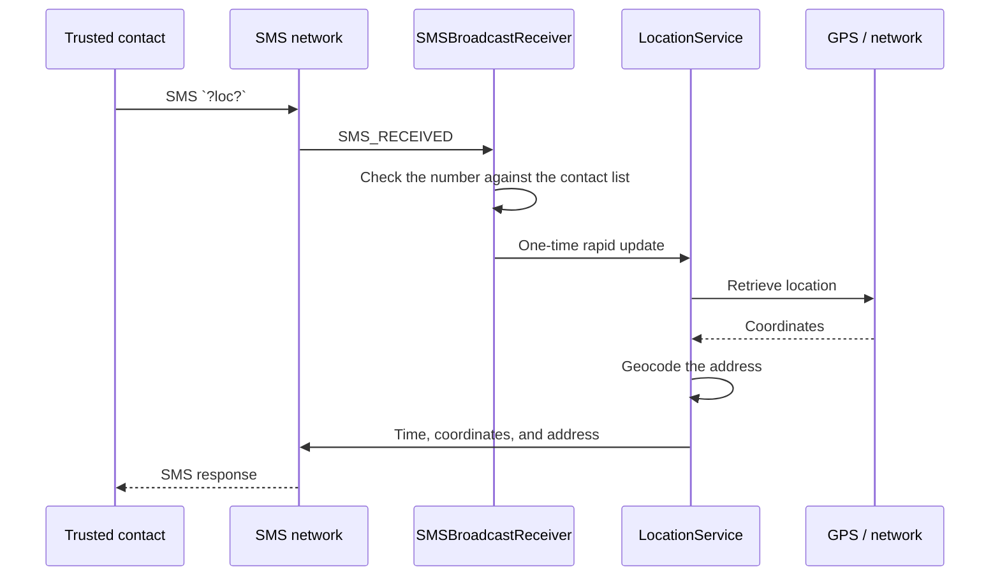

# FamilySonar

Family safety application for Android that allows users to share their location with trusted contacts via SMS. The project was created as a practical portfolio demonstrating work with native Android, the lifecycle of background services, system permissions, and SMS-based communication.

> **Project status:** working portfolio prototype, version `1.0`.

## Table of contents

- [About the project](#about-the-project)
- [Key features](#key-features)
- [How the location flow works](#how-the-location-flow-works)
- [Technologies](#technologies)
- [Getting started](#getting-started)
- [Testing on a device](#testing-on-a-device)
- [Permissions and privacy](#permissions-and-privacy)
- [Project structure](#project-structure)
- [Technical decisions](#technical-decisions)
- [Limitations and future development](#limitations-and-future-development)
- [Portfolio purpose](#portfolio-purpose)

## About the project

FamilySonar is a "trusted contacts" application. The user saves the phone numbers of people they trust, and the application can:

- send an SOS message containing the coordinates of the last known location,
- respond to an authorized location request sent by SMS,
- retrieve GPS or network location in the background,
- send the coordinates, address, and measurement time to a selected contact,
- show the current permission status and guide the user through granting permissions.

The application does not require its own backend or a user account. Data is exchanged through standard Android mechanisms and the mobile carrier network.

## Key features

### Trusted contacts

- add phone numbers through the user interface,
- persist the contact list in the application storage,
- remove a contact with a swipe gesture,
- manually send a location request to a selected number.

### Emergency location sharing

- the SOS button sends the current coordinates to all saved contacts,
- a recipient can request the location with the `?loc?` message,
- requests are accepted only from numbers saved as trusted contacts,
- the response contains the measurement time, coordinates, and the address obtained through geocoding,
- rapid updates run for a limited time, after which the service returns to power-saving mode.

### Background operation

- `LocationService` runs as a foreground service with a visible notification,
- the application responds to received SMS messages through a `BroadcastReceiver`,
- the user is provided with a shortcut to the battery optimization settings.

## How the location flow works



## Technologie

- **Java 8** i natywne **Android SDK**
- **Android Gradle Plugin 8.13.0**
- **Gradle 8.13 Wrapper**
- **compileSdk 36**, **targetSdk 34**, **minSdk 28** (Android 9)
- **AndroidX AppCompat**
- **Material Components 1.12.0**
- **ConstraintLayout 2.1.4**
- **Navigation Component 2.7.7**
- **Google Play Services Location 15.0.1**
- `ViewBinding` and `RecyclerView`

## Getting started

### Requirements

- Android Studio with Gradle 8.13 support,
- JDK 17 or newer,
- Android SDK with the API 36 platform,
- a device running Android 9 or newer; SMS testing requires a SIM card and the ability to send and receive messages.

### Cloning and synchronization

```powershell
git clone https://github.com/marek-czelen/FamilySonar.git
cd FamilySonar
```

Open the project directory in Android Studio and let the IDE synchronize the project with Gradle. When using a terminal, make sure that `JAVA_HOME` points to JDK 17+ and that `local.properties` contains the path to the Android SDK.

### Building from the terminal

Windows PowerShell:

```powershell
./gradlew.bat assembleDebug
./gradlew.bat assembleRelease
```

APK artifacts will be saved to:

```text
app/build/outputs/apk/debug/app-debug.apk
app/build/outputs/apk/release/app-release.apk
```

The release variant currently uses the debug signing configuration because this repository is a portfolio project rather than a production publishing process.

## Testing on a device

The most reliable test scenario requires two phones, or a phone and another device with an active phone number:

1. Build and install the debug variant.
2. On first launch, grant SMS, location, notification, and background location permissions.
3. Disable battery optimization for FamilySonar.
4. Add the test number as a trusted contact.
5. Send `?loc?` from the second phone to the device running FamilySonar.
6. Check that the application retrieves the location and sends three messages in response: the time, coordinates, and address.
7. Also test the SOS button and a manual location request from the contact list.

For a quick installation test on a connected device, use:

```powershell
./gradlew.bat assembleDebug
adb install -r app/build/outputs/apk/debug/app-debug.apk
adb shell monkey -p com.familysonar 1
```

An emulator is useful for checking the UI and application lifecycle, but it does not replace testing on a physical device for SMS delivery and location accuracy.

## Permissions and privacy

The application uses sensitive permissions because they are required for its functionality:

| Permission | Purpose |
| --- | --- |
| `ACCESS_FINE_LOCATION` / `ACCESS_COARSE_LOCATION` | Retrieve GPS and network location |
| `ACCESS_BACKGROUND_LOCATION` | Location updates when the application is not on screen |
| `RECEIVE_SMS` | Receive `?loc?` requests |
| `SEND_SMS` | Send location and SOS responses |
| `FOREGROUND_SERVICE_LOCATION` | Keep the location service running reliably in the background |
| `POST_NOTIFICATIONS` | Display the foreground service notification |
| `WAKE_LOCK` | Complete a short location operation |
| `INTERNET` | Geocode coordinates into an address |

The contact list is stored locally in the application's data file. Request authorization is based on comparing the sender's number with the saved contacts. The project does not contain a server or an external database.

## Project structure

```text
FamilySonar/
├── app/
│   ├── src/main/java/com/familysonar/
│   │   ├── MainActivity.java          # main screen and permission handling
│   │   ├── LocationService.java       # location in a foreground service
│   │   ├── SMSBroadcastReceiver.java  # receive and verify SMS requests
│   │   ├── AlarmReceiverClass.java    # manual location requests
│   │   ├── ConfigData.java            # local configuration storage
│   │   └── ContactsAdapter.java       # contact list in RecyclerView
│   ├── src/main/res/                  # layouts, themes, graphics, and navigation
│   └── build.gradle
├── gradle/libs.versions.toml         # centralized dependency versions
├── gradlew / gradlew.bat             # wrapper Gradle
└── settings.gradle
```

## Technical decisions

- **Foreground service instead of a hidden process:** Android requires long-running location work to be explicitly indicated. The notification informs the user that the service is active.
- **Two location sources:** GPS provides better accuracy outdoors, while the network provider increases the chance of obtaining a result indoors or with a weak GPS signal.
- **Power-saving and rapid modes:** the standard interval is 15 minutes, while a contact request starts rapid updates every 10 seconds for a limited time.
- **Phone-number authorization:** a received request is not processed for an unknown sender.
- **No backend:** SMS simplifies deployment and allows the application to work without an account or a maintained server, at the cost of limited throughput and dependence on the carrier.

## Limitations and future development

The current version is intentionally a portfolio prototype. The main areas for future work are:

- unit and instrumentation tests for permission flows, SMS reception, and error handling,
- validation and normalization of phone numbers across different country formats,
- more secure contact data storage and more detailed privacy settings,
- handling SMS sending errors, unavailable locations, and disabled providers,
- moving location and communication logic out of the `Activity` into separate layers,
- release signing configuration and a CI pipeline,
- considering push notifications or a backend for scenarios where SMS is not sufficient.

## Portfolio purpose

The project demonstrates practical skills related to:

- designing Android applications that operate outside the foreground,
- working with Android's modern permission model,
- integrating GPS, geocoding, SMS, and notifications,
- responding to system events through a `BroadcastReceiver`,
- building a simple and resilient communication flow without a backend,
- consciously documenting trade-offs, risks, and future development steps.

The project is a good starting point for discussing Android architecture, background service limitations, location data privacy, and testing hardware-dependent features.