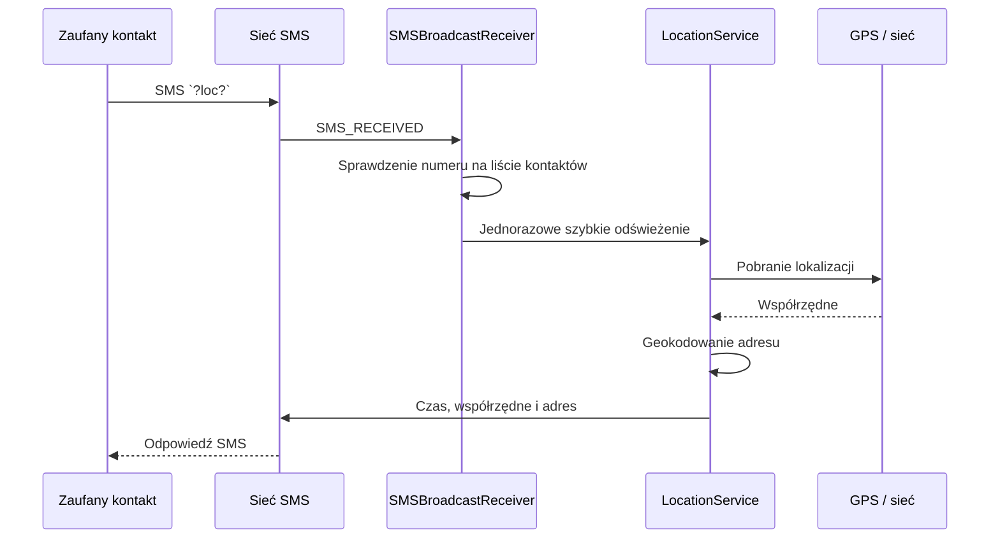

# FamilySonar

Rodzinna aplikacja bezpieczeństwa na Androida, która pozwala udostępniać lokalizację zaufanym kontaktom przez SMS. Projekt powstał jako praktyczne portfolio pokazujące pracę z natywnym Androidem, cyklem życia usług działających w tle, uprawnieniami systemowymi oraz komunikacją opartą o SMS.

> **Status projektu:** działający prototyp portfolio, wersja `1.0`.

## Spis treści

- [O projekcie](#o-projekcie)
- [Najważniejsze funkcje](#najważniejsze-funkcje)
- [Jak działa przepływ lokalizacji](#jak-działa-przepływ-lokalizacji)
- [Technologie](#technologie)
- [Uruchomienie](#uruchomienie)
- [Testowanie na urządzeniu](#testowanie-na-urządzeniu)
- [Uprawnienia i prywatność](#uprawnienia-i-prywatność)
- [Struktura projektu](#struktura-projektu)
- [Decyzje techniczne](#decyzje-techniczne)
- [Ograniczenia i dalszy rozwój](#ograniczenia-i-dalszy-rozwój)
- [Cel portfolio](#cel-portfolio)

## O projekcie

FamilySonar jest aplikacją typu „trusted contacts”. Użytkownik zapisuje numery osób, którym ufa, a aplikacja może:

- wysłać wiadomość SOS zawierającą współrzędne ostatniej lokalizacji,
- odpowiedzieć na autoryzowane żądanie lokalizacji wysłane SMS-em,
- pobierać lokalizację GPS lub sieciową w tle,
- przesłać współrzędne, adres oraz czas pomiaru do wskazanego kontaktu,
- pokazać aktualny stan uprawnień i prowadzić użytkownika przez ich nadanie.

Aplikacja nie wymaga własnego backendu ani konta użytkownika. Wymiana danych odbywa się przez standardowe mechanizmy Androida i sieć operatora komórkowego.

## Najważniejsze funkcje

### Kontakty zaufane

- dodawanie numerów telefonów z poziomu interfejsu,
- trwałe zapisywanie listy kontaktów w pamięci aplikacji,
- usuwanie kontaktu gestem przesunięcia,
- ręczne wysłanie żądania lokalizacji do wybranego numeru.

### Lokalizacja w sytuacji alarmowej

- przycisk SOS wysyła do wszystkich zapisanych kontaktów bieżące współrzędne,
- odbiorca może poprosić o lokalizację wiadomością `?loc?`,
- żądania są akceptowane wyłącznie od numerów zapisanych jako zaufane,
- odpowiedź zawiera czas pomiaru, współrzędne oraz adres uzyskany przez geokodowanie,
- szybkie odświeżenie działa przez ograniczony czas, a następnie usługa wraca do trybu oszczędnego.

### Praca w tle

- `LocationService` działa jako foreground service z widocznym powiadomieniem,
- aplikacja reaguje na odebrane SMS-y przez `BroadcastReceiver`,
- użytkownik otrzymuje skrót do ustawień optymalizacji baterii.

## Jak działa przepływ lokalizacji



## Technologie

- **Java 8** i natywne **Android SDK**
- **Android Gradle Plugin 8.13.0**
- **Gradle 8.13 Wrapper**
- **compileSdk 36**, **targetSdk 34**, **minSdk 28** (Android 9)
- **AndroidX AppCompat**
- **Material Components 1.12.0**
- **ConstraintLayout 2.1.4**
- **Navigation Component 2.7.7**
- **Google Play Services Location 15.0.1**
- `ViewBinding` oraz `RecyclerView`

## Uruchomienie

### Wymagania

- Android Studio z obsługą Gradle 8.13,
- JDK 17 lub nowsze,
- Android SDK z platformą API 36,
- urządzenie z Androidem 9+; do testów SMS potrzebna jest karta SIM i możliwość wysyłania/odbierania wiadomości.

### Klonowanie i synchronizacja

```powershell
git clone https://github.com/marek-czelen/FamilySonar.git
cd FamilySonar
```

Otwórz katalog projektu w Android Studio i pozwól IDE zsynchronizować projekt z Gradle. W przypadku używania terminala upewnij się, że `JAVA_HOME` wskazuje na JDK 17+ oraz że `local.properties` zawiera ścieżkę do Android SDK.

### Budowanie z terminala

Windows PowerShell:

```powershell
./gradlew.bat assembleDebug
./gradlew.bat assembleRelease
```

Artefakty APK zostaną zapisane w:

```text
app/build/outputs/apk/debug/app-debug.apk
app/build/outputs/apk/release/app-release.apk
```

Wersja release korzysta obecnie z konfiguracji podpisywania debug, ponieważ repozytorium jest projektem portfolio, a nie procesem publikacji produkcyjnej.

## Testowanie na urządzeniu

Najpewniejszy scenariusz testowy wymaga dwóch telefonów lub telefonu i drugiego urządzenia z aktywnym numerem:

1. Zbuduj i zainstaluj wariant debug.
2. Przy pierwszym uruchomieniu przyznaj uprawnienia do SMS, lokalizacji, powiadomień i lokalizacji w tle.
3. Wyłącz optymalizację baterii dla FamilySonar.
4. Dodaj numer testowego kontaktu zaufanego.
5. Z drugiego telefonu wyślij `?loc?` na urządzenie z FamilySonar.
6. Sprawdź, czy aplikacja pobierze lokalizację i odeśle trzy wiadomości: czas, współrzędne oraz adres.
7. Przetestuj także przycisk SOS oraz ręczne żądanie lokalizacji z listy kontaktów.

Do szybkiego testu instalacji na podłączonym urządzeniu można użyć:

```powershell
./gradlew.bat assembleDebug
adb install -r app/build/outputs/apk/debug/app-debug.apk
adb shell monkey -p com.familysonar 1
```

Emulator jest przydatny do sprawdzania UI i cyklu życia aplikacji, ale nie zastępuje testu na fizycznym urządzeniu dla odbioru i wysyłania SMS oraz dokładności lokalizacji.

## Uprawnienia i prywatność

Aplikacja korzysta z wrażliwych uprawnień, ponieważ są one niezbędne do realizacji jej funkcji:

| Uprawnienie | Zastosowanie |
| --- | --- |
| `ACCESS_FINE_LOCATION` / `ACCESS_COARSE_LOCATION` | Pobieranie lokalizacji GPS i sieciowej |
| `ACCESS_BACKGROUND_LOCATION` | Aktualizacje lokalizacji poza ekranem aplikacji |
| `RECEIVE_SMS` | Odbiór żądań `?loc?` |
| `SEND_SMS` | Wysyłanie odpowiedzi lokalizacyjnych i SOS |
| `FOREGROUND_SERVICE_LOCATION` | Stabilna praca usługi lokalizacyjnej w tle |
| `POST_NOTIFICATIONS` | Widoczne powiadomienie usługi foreground |
| `WAKE_LOCK` | Dokończenie krótkiej operacji lokalizacyjnej |
| `INTERNET` | Geokodowanie współrzędnych na adres |

Lista kontaktów jest zapisywana lokalnie w pliku danych aplikacji. Mechanizm autoryzacji żądań opiera się na porównaniu numeru nadawcy z zapisanymi kontaktami. Projekt nie zawiera serwera ani zewnętrznej bazy danych.

## Struktura projektu

```text
FamilySonar/
├── app/
│   ├── src/main/java/com/familysonar/
│   │   ├── MainActivity.java          # ekran główny i obsługa uprawnień
│   │   ├── LocationService.java       # lokalizacja w foreground service
│   │   ├── SMSBroadcastReceiver.java  # odbiór i weryfikacja żądań SMS
│   │   ├── AlarmReceiverClass.java    # ręczne żądania lokalizacji
│   │   ├── ConfigData.java            # lokalny zapis konfiguracji
│   │   └── ContactsAdapter.java       # lista kontaktów w RecyclerView
│   ├── src/main/res/                  # layouty, motywy, grafiki i nawigacja
│   └── build.gradle
├── gradle/libs.versions.toml         # centralne wersje zależności
├── gradlew / gradlew.bat             # wrapper Gradle
└── settings.gradle
```

## Decyzje techniczne

- **Foreground service zamiast ukrytego procesu:** Android wymaga jawnego sygnalizowania długotrwałej pracy związanej z lokalizacją. Powiadomienie informuje użytkownika, że usługa jest aktywna.
- **Dwa źródła lokalizacji:** GPS daje lepszą dokładność na zewnątrz, a provider sieciowy zwiększa szansę na wynik w pomieszczeniach lub przy słabym sygnale GPS.
- **Tryb oszczędny i szybki:** standardowy interwał wynosi 15 minut, natomiast żądanie kontaktu uruchamia szybkie odświeżenie co 10 sekund z limitem czasu.
- **Autoryzacja numerem telefonu:** odebrane żądanie nie jest wykonywane dla nieznanego nadawcy.
- **Brak backendu:** SMS upraszcza wdrożenie i pozwala działać bez konta oraz bez utrzymywania serwera, kosztem ograniczonej przepustowości i zależności od operatora.

## Ograniczenia i dalszy rozwój

Obecna wersja jest świadomie prototypem portfolio. Najważniejsze obszary dalszej pracy:

- testy jednostkowe i testy instrumentacyjne dla przepływu uprawnień, odbioru SMS i obsługi błędów,
- walidacja i normalizacja numerów telefonu z uwzględnieniem różnych formatów krajowych,
- bezpieczniejsze przechowywanie danych kontaktów oraz bardziej szczegółowe ustawienia prywatności,
- obsługa błędów wysyłania SMS, braku lokalizacji i wyłączonych providerów,
- wydzielenie logiki lokalizacji i komunikacji z `Activity` do osobnych warstw,
- konfiguracja podpisywania release oraz pipeline CI,
- rozważenie powiadomień push lub backendu dla scenariuszy, w których SMS nie jest wystarczający.

## Cel portfolio

Projekt prezentuje praktyczne umiejętności związane z:

- projektowaniem aplikacji Android działającej poza pierwszym planem,
- obsługą nowoczesnego modelu uprawnień Androida,
- integracją GPS, geokodowania, SMS i powiadomień,
- reagowaniem na zdarzenia systemowe przez `BroadcastReceiver`,
- budowaniem prostego, odpornego przepływu komunikacji bez backendu,
- świadomym opisywaniem kompromisów, ryzyk i kolejnych kroków rozwoju.

Projekt jest dobrym punktem wyjścia do rozmowy o architekturze Androida, ograniczeniach usług w tle, prywatności danych lokalizacyjnych oraz testowaniu funkcji zależnych od sprzętu.